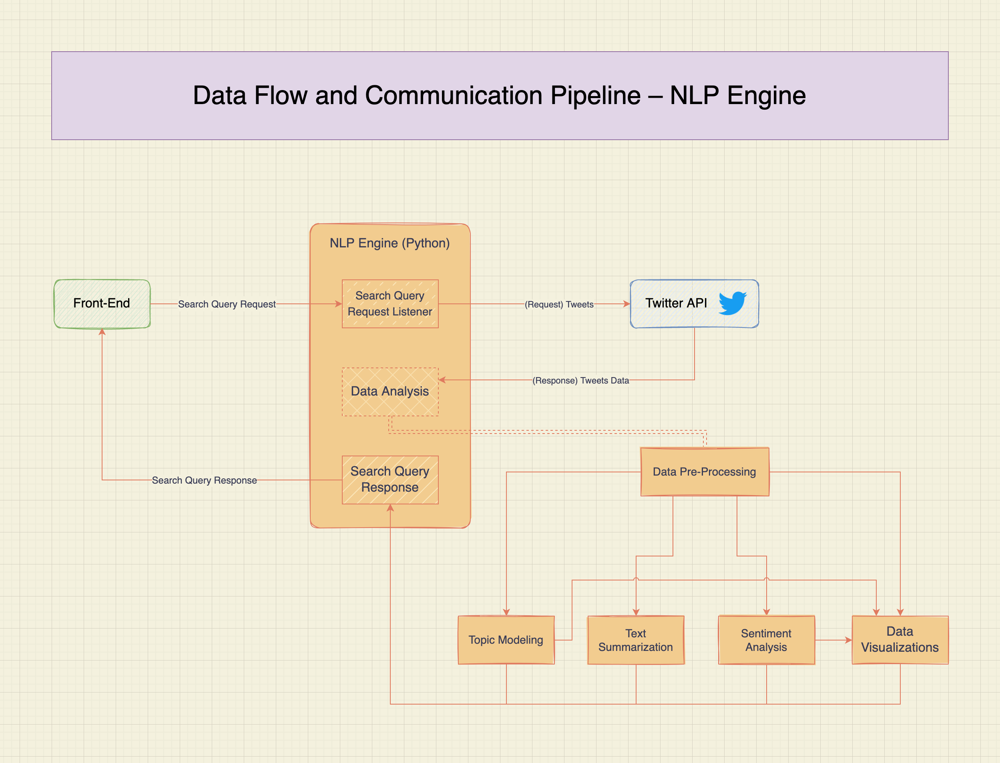

# PekinSearch NLP Engine

The natural language processing (NLP) engine behind PekinSearch. This portion of the application is in charge of processing search queries, retrieving social media posts, transforming the data into human-readable formats, extracting information from the data, and creating impactful visualizations.

Some of the data transformations and machine learning techniques used in this section include:
- Text Summarization
- Topic Modeling
- Sentiment Analysis
- Data Visualizations

## Data Flow

## API
- Search Query Request
    - Request Type: `GET`
    - Path: `/search/<start>/<end>/<tags>/`
        - start: The timeline's start date for the search in the `MMDDYYYY` format.
        - end: The timeline's end date for the search in the `MMDDYYYY` format.
        - tags: The comma-separated list of hashtags to include in the search.
    - Response Type: JSON
    - Example Request: `/search/01012020/12312021/cellphone,iphone,apple,tech/`

## Topic Modeling Diagram

## Useful Links
- Twitter API
    - Docs: https://developer.twitter.com/en/docs
    - Sample Code: https://github.com/twitterdev/Twitter-API-v2-sample-code
- HuggingFace:
    - Text Summarization: https://huggingface.co/tasks/summarization
    - Topic Modeling: https://towardsdatascience.com/topic-modeling-with-bert-779f7db187e6
    - Sentiment Analysis: https://huggingface.co/blog/sentiment-analysis-python
